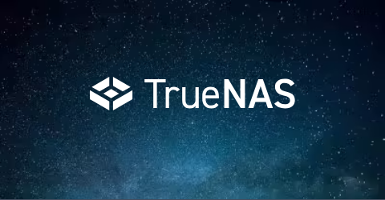
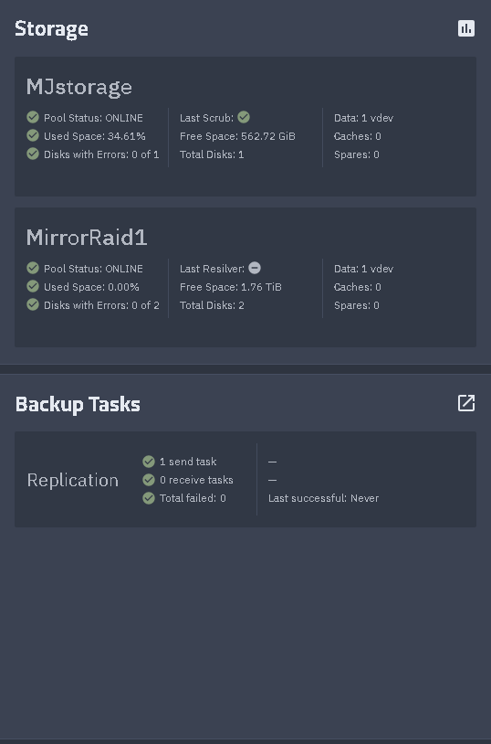
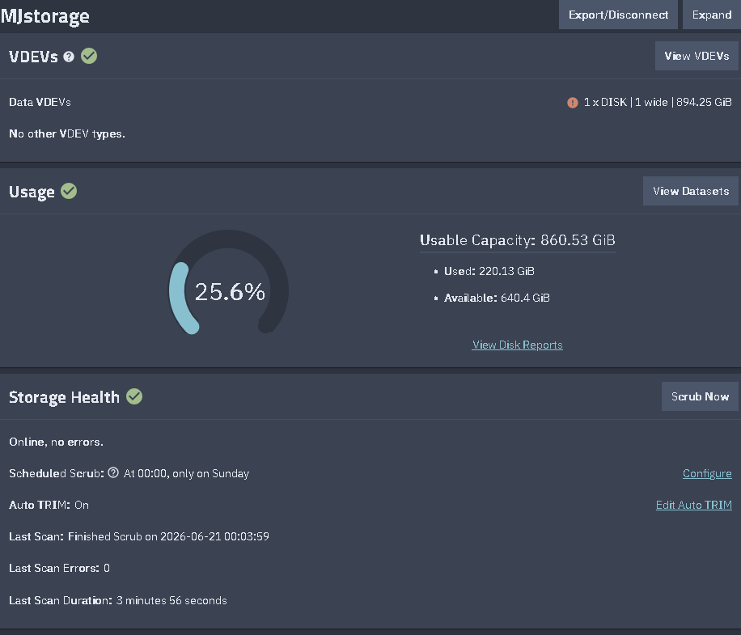
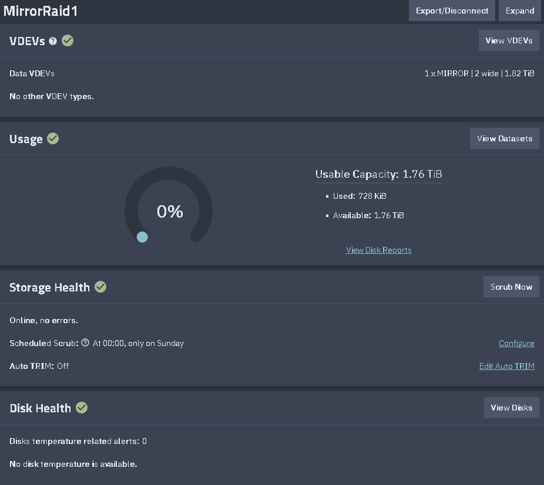
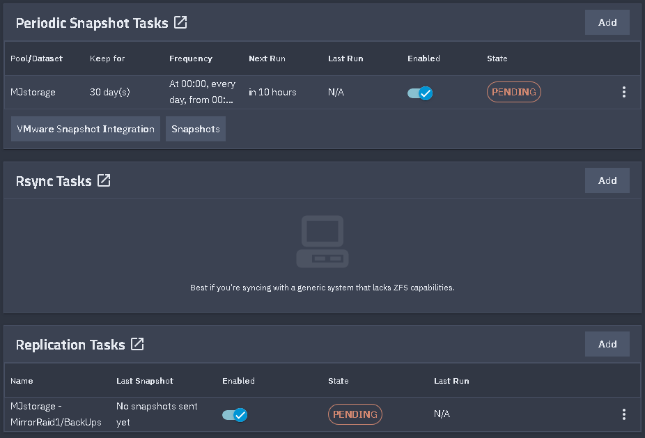

# 🗄️ TrueNAS Homelab


> Enterprise-style TrueNAS Scale homelab built to develop practical skills in storage administration, virtualization, networking, Linux, Windows, and infrastructure management.

---

# 📖 Overview

This repository documents the build, configuration, and administration of my **TrueNAS Scale** server.

The server serves as the foundation of my enterprise-style homelab and provides centralized storage, virtualization, snapshots, backups, and network services used for learning and portfolio development.

Unlike my **network-diagram** repository, this project focuses on the server itself—how it is configured, maintained, and expanded.

---

# 🖥️ TrueNAS Dashboard



---

# 🏗️ Infrastructure

The TrueNAS server provides:

- Centralized storage
- KVM Virtualization
- Snapshot management
- Data protection
- Virtual Machine hosting
- Secure network services

---

# 💾 Storage

Current storage responsibilities include:

- Storage Pool Management
- Dataset Organization
- Snapshot Scheduling
- Backup Planning
- Capacity Monitoring

Future additions include:

- Replication
- Automated Backup Verification
- Cloud Backup Integration

---

# 🖥️ Virtual Machines

The server currently hosts the following virtual machines.

| Virtual Machine | Purpose |
|-----------------|---------|
| Windows 11 | Windows administration & testing |
| Ubuntu Server | Linux administration & development |
| Kali Linux | Security testing & networking |

---

# 🌐 Network Services

Infrastructure services currently include:

- Pi-hole DNS
- DNS Filtering
- Advertisement Blocking
- DNS Query Logging
- Secure Remote Access (Tailscale)

---

# 🔐 Security

Security practices implemented throughout the lab include:

- Router firewall
- VPN-only remote administration
- Regular snapshots
- Backup strategy
- Strong authentication
- Service isolation
- Routine system updates

---

# 📂 Repository Structure

```text
truenas-homelab/
│
├── README.md
├── docs/
│   ├── installation.md
│   ├── storage.md
│   ├── networking.md
│   ├── virtualization.md
│   ├── backups.md
│   └── troubleshooting.md
│
├── images/
│   ├── Network_Diagram.png
│   ├── dashboard.png
│   ├── storage-pools.png
│   ├── datasets.png
│   ├── virtual-machines.png
│   └── snapshots.png
│
├── scripts/
│   └── backup-check.sh
│
└── screenshots/
```

---

# 📚 Documentation

This repository includes documentation for:

- Initial Installation
- Storage Configuration
- Dataset Organization
- Virtual Machine Deployment
- Network Configuration
- Backup Strategy
- Snapshot Management
- Troubleshooting
- Future Improvements

---

# 🛠️ Technologies

### Infrastructure

- TrueNAS Scale
- KVM Virtualization
- ZFS
- Pi-hole
- Tailscale VPN

### Operating Systems

- Windows 11
- Ubuntu Server
- Kali Linux

### Management

- Git
- GitHub
- SSH
- Web Administration

---

# 🎯 Skills Demonstrated

This project showcases practical experience with:

- Storage Administration
- ZFS Storage Management
- Virtualization
- Linux Administration
- Windows Administration
- DNS Administration
- Infrastructure Documentation
- Backup & Recovery
- Network Troubleshooting
- System Monitoring
- Security Hardening

---

# 🚀 Roadmap

Planned improvements include:

- [ ] Docker Applications
- [ ] Active Directory Lab
- [ ] Monitoring with Grafana
- [ ] Prometheus Integration
- [ ] VLAN Segmentation
- [ ] Reverse Proxy
- [ ] Automated Backups
- [ ] Infrastructure as Code

---

# 📸 Screenshots

| Dashboard | Storage |
|-----------|---------|
|  | |  | |

| Virtual Machines | Snapshots |
|------------------|-----------|
|  |  |

---

# 🔗 Related Projects

- **Enterprise Homelab Network Diagram** – High-level network architecture and documentation
- **Linux Administration Lab**
- **PowerShell Automation**
- **Networking Lab**

---

# 📝 Notes

This repository is intended for educational and portfolio purposes. Administrative endpoints, sensitive configuration details, and internal infrastructure information have been intentionally omitted while preserving the overall design and technical implementation.

---

## 📄 License

This project is released under the MIT License and is intended for learning, documentation, and portfolio purposes.
